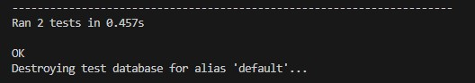
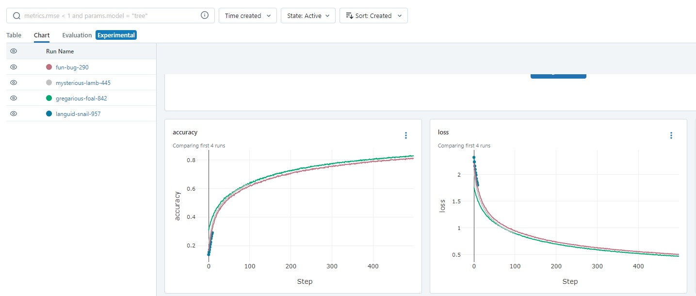
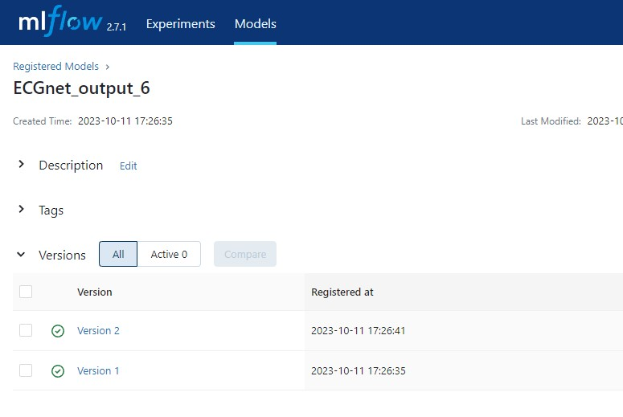

# 231011

## 상황
- 서로 다른 두 프로젝트에 대한 동시 대응이 발생함
- django api에 신규 app을 추가해야함
- 신규 app이 기존 app과 거의 유사한 서비스임(한국어 서비스->일본어 서비스 변경)
- 한국어->일본어, 일본어->한국어 번역 기능에 대한 테스트만 통과하면 app 구현이 완료됨
- 인공지능 모델에 대한 빠른 검증이 필요한 상황 발생


## 분석
- django app 생성 시, 일종의 상속과 관련된 구현 방식에 대해 알지 못함(현재 상태)
- 한일/일한 번역에 대한 적용 테스트를 이전처럼 print 구문이나 api로 진행하는 것은 번거로울 것으로 보임
- testcode에 대한 도입의 필요성 사전에 습득함(TDD 방법론)
- MLflow를 도입하여 인공지능 모델 학습을 진행중이었던 상황. MLflow ui를 활용하여 빠르게 인공지능 학습 상황 판단 가능할 것으로 예상됨

## 개발
### testcode 작성
- 신규 기능(한일/일한 번역 기능) 구현
    ```python
    # modules/translate_module.py
    import googletrans

    translator = googletrans.Translator()

    def transrate_to_jp(kr_text: str) -> str:
        jp_text: str = translator.translate(kr_text, dest='ja').text
        return jp_text

    def transrate_to_kr(jp_text: str) -> str:
        kr_text: str = translator.translate(jp_text, dest='ko').text
        return kr_text
    ```
- testcode 작성
    ```python
    # tests.py
    from django.test import TestCase
    import re

    class JapaneseTest(TestCase):
        def test_jp_to_kr(self):
            text = "안녕하세요?"
            kr_text = transrate_to_kr(text)
            print(kr_text)
            self.assertTrue(self.is_korean(kr_text))

        def test_kr_to_jp(self):
            text = "こんにちは"
            jp_text = transrate_to_jp(text)
            print(jp_text)
            self.assertTrue(self.is_japanese(jp_text))

        def is_japanese(self, text):
            # 유니코드 속성을 사용하여 일본어 문자를 확인
            pattern = re.compile(r'[{Hiragana}|{Katakana}|{Han}|ー。、]+')
            return bool(pattern.search(text))
        
        def is_korean(self, text):
            # 정규 표현식을 사용하여 한국어 문자를 포함하는지 확인
            pattern = re.compile(r'[ㄱ-ㅎ|ㅏ-ㅣ|가-힣]+')
            return bool(pattern.search(text))

    ```
- 결과

  

### MLflow 도입
- MLflow의 학습기록 확인

  
- model 파일 다운로드
- MLflow의 Models 데이터에 학습이 잘 된 모델을 register 해서 관리 가능

  

## 회고
- django 자체의 기본적인 구성 및 코딩은 가능하지만 효율적인 관리 능력이 미숙함
- 클린코드 및 클린 아키텍쳐 등의 책을 참고하여 app 구조 등을 설계하는 방법을 공부해야할 것 같음
- MLflow의 사용방법 문서화하여 팀 내에 공유하는것이 좋아보임
- MLflow를 미리 도입한 덕에 인공지능 학습에 대한 요청 대응이 빨랐다! 스스로를 칭찬할 것