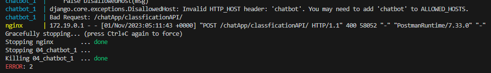

# 231101 docker로 django 배포

## 상황
- django를 docker로 배포하는 기술을 습득하여야 함(수요기업 요구사항)
- python manage.py를 쓰는 일반적인 실행이 아니라 nginx 및 gunicorn을 이용하여 안정적인 배포를 시도해야함

## 분석
- docker 단일 배포와 더불어 docker-compose를 이용한 컨테이너 연동이 필요
- 상세 내용은 아래에 작성
    - [docker 이미지 파일 만들기](../docker//2.%20docker%20이미지%20파일%20만들기.md)
    - [docker로 django와 nginx 연결](../docker/3.%20docker로%20django와%20nginx%20연결.md)

## 개발
### django의 confing.settings의 ALLOWED_HOST
- 문제점

- 해결방안
    - django의 settings에서 ALLOWED_HOSTS에 도메인이 작성되어있지 않음
    - nginx.conf에 적힌 chabot이라는 값을 입력해야함
    ```python
    # config.settings
    ALLOWED_HOSTS = ["chatbot","localhost", "127.0.0.1"] #chatbot 추가
    ```