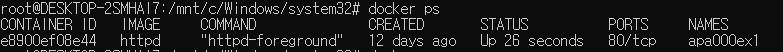
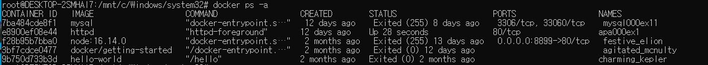
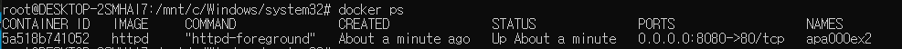

## 컨테이너 생성, 실행, 중지, 삭제 기본 명령어
### 컨테이너 목록 출력
``` bash
docker ps #실행중인 컨테이너 출력
docker pas -a #모든 컨테이너 출력
```



### 컨테이너 생성
``` bash
docker run --name apa000ex1 -d httpd
```
- 컨테이너 이름: appa000ex1
- 이미지 이름: httpd

### 컨테이너 생성 후 실행
``` bash
docker run --name apa000ex1 -d httpd #apa000ex1 란 이름의 컨테이너에 httpd(아파치) 이미지 다운로드)
```

### 이미 생성된 컨테이너 실행
``` bash
docker start apa000ex1 # apa000ex1란 이름의 컨테이너 실행
```

### 컨테이너 종료
``` bash
docker stop apa000ex1 # apa000ex1이라는 이름의 컨테이너 삭제
```

### 컨테이너 삭제
``` bash
docker rm apa000ex1
```

### 포트 설정 명령어
``` bash
docker run --name apa000ex2 -d -p 8080:80 httpd
# 8080은 현재 컴퓨터와 docker를 연결해주는 포트
# 80은 docker 내부에서 apach와 연동되는 포트
```

