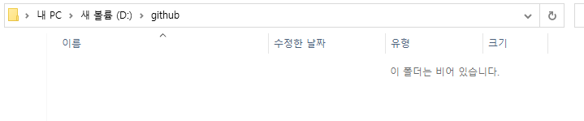
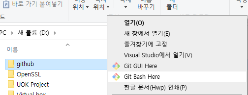
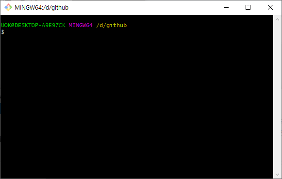
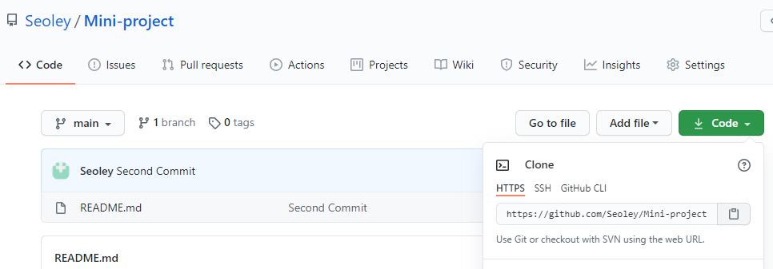
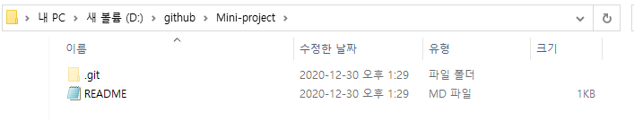
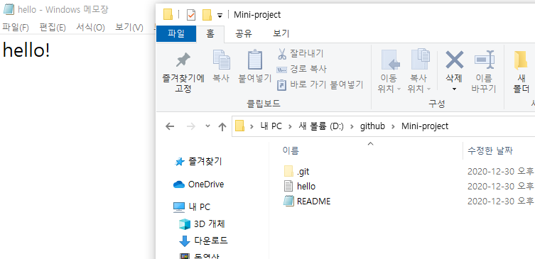

# 0. 시작하며

깃허브는 시작이 가장 큰 난관이다. 레포지토리는 어떻게 생성하는 것이며, 이것을 컴퓨터로 어떻게 가져오는 것이며, 또 컴퓨터에서 수정한 파일은 어떻게 깃허브에 반영할 수 있는 것인가? 

나 또한 레포지토리 생성, 로컬저장소 생성 및 커밋을 하는 단계에서 어려움을 겪어 프로그래밍을 하는 내내 깃허브를 사용하지 않았다. 하지만 프로젝트가 기본이 되는 실무에서는 깃허브는 거의 필수적인 요소가 된다고 생각한다. 물론 다른 소스정리 방법이 있다면 그쪽을 사용해도 되겠지만... 보편적으로 많이 사용하는 방법이라는 것은 그만큼 효용성이 입증되었다는 의미이기에, 깃허브를 다루는 방법에 대해 공부할 필요가 있다고 판단했다.

여기에서는 다음과 같은 내용을 설명하고 있다.
```
💡 깃허브에 레포지토리 저장소 만드는 법
```
```
💡 깃허브 레포지토리를 컴퓨터 내에 저장한 후, 컴퓨터 내의 로컬저장소와 연동하는 법
```
```
💡 로컬저장소에서 변경한 내용을 깃허브 레포지토리에 반영하는 법
```


# 1. 깃허브 레포지토리 생성

# 2. 레포지토리 - 로컬저장소 연동

## 1) Git bash 실행

### (1) github 폴더 생성

나는 github라는 폴더에 github의 레포지토리들을 모두 저장해 관리하기로 하였다. 폴더 이름은 원하는대로 지정해도 괜찮다. 

github의 폴더에는 아무것도 없는 빈 상태다.



이후 이 폴더에는 로컬저장소 폴더들이 생겨날 것이다.

### (2) Git bash 실행

이후 github 폴더에서 Git bash를 작동시킨다. github 폴더를 우클릭하면 Git Bash Here라는 메뉴가 있다. 해당 메뉴를 클릭하면 된다.



Git bash를 실행하면 다음과 같은 커맨드 창이 나타난다. github의 레포지토리와 로컬저장소를 관리하기 위해서는 Git bash를 기본적으로 사용한다. 또한, Git bash는 git이라고 하는 명령어를 통해 다양한 동작을 실행할 수 있다.



## 2) Git clone - 레포지토리를 로컬저장소에 복사

### (1) git 주소 복사

로컬저장소에 연동시키 레포지토리에서 code를 클릭하면 다음과 같은 화면이 나타난다.



여기에서 git 주소를 복사한다. https://github.com/Seoley/Mini-project.git 이므로, 해당 주소를 예제로 설명을 진행하도록 하겠다.

### (2) git clone 사용

위의 Git bash 커맨드 화면에서 git clone을 입력한다.

```bash
git clone https://github.com/Seoley/Mini-project.git
```

그러면 다음과 같이 github 폴더 내에 Mini-project 폴더가 생성된다.


이후 우리는 내 컴퓨터 로컬저장소인 Mini-project의 내용을 수정하여, github의 Mini-project 레포지토리를 수정할 수 있다.

# 3. 로컬저장소 데이터를 레포지토리에 커밋하기

레포지토리도 생성하였고, 로컬저장소와 연동도 하였으니 실제로 이 로컬저장소에서 작업을 진행한 후 레포지토리에 업로드하는 방법에 대해 알아보도록 하겠다.

로컬저장소의 변경 내용을 레포지토리에 반영하는 것을 "commit"이라고 부른다. 여기서 잠깐, 깃허브의 유용함에 대해 이야기를 하자면 깃허브는 commit을 할 때 마다 깃허브 내부에 변경점이 저장된다. 그렇다는건, 이전 파일로 복구하는 것이 어렵지 않다는 것이다.

예를 들어서, 개발자 A가 게시글 쓰기 기능을 만들어서 commit을 하였다고 하자. 그 다음에 개발자 B가 게시글 쓰기 기능을 업그레이드 한 후 commit을 하였다. 그런데, B가 만든 기능에 오류가 발생하였다. 그렇다면 우리는 B가 업그레이드를 하기 전의 파일로 데이터를 되돌릴 필요가 있다.

commit 할 때 마다 깃허브 내부에 변경점이 된다는 것은, A가 commit 했을 때의 파일, 즉 B가 업그레이드 하기 전의 파일 내용이 저장되어있다는 의미다. 그렇기에 github가 유지보수에 많이 활용되는 것이다.

## 1) 로컬저장소 파일 레포지토리에 커밋하는 법

### (1) 로컬저장소에 새 파일 작성

우선, 로컬저장소에 hello.txt라고 하는 파일을 만들어보자. 메모장을 이용해 작성하면 된다.



그 다음, Git bash를 Mini-project에서 실행한다. 위에서 github 폴더에 우클릭을 한 후 Git bash를 실행한 것 처럼 하면 된다. (Git bash 창에서 cd를 이용해 디렉토리를 변경해도 된다.)

### (2) commit 실행

Git bash를 오픈했다면 다음의 순서대로 명령어를 한 줄 씩 입력한다. 각 명령어가 어떤 의미를 지니는지는 후술한다.

```bash
git status
git add *
git commit -m "First commit"
git push
```

## 2) git 명령어 설명

작성중...

## 3) 

# 참고자료

[깃허브 사용법(github 입문)](https://homeproject.tistory.com/9)